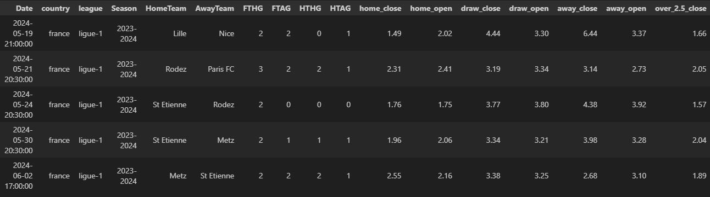
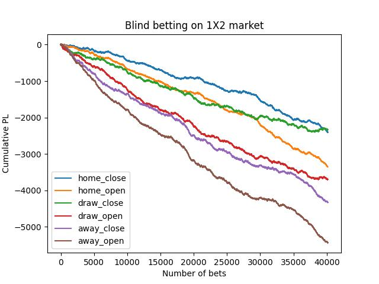
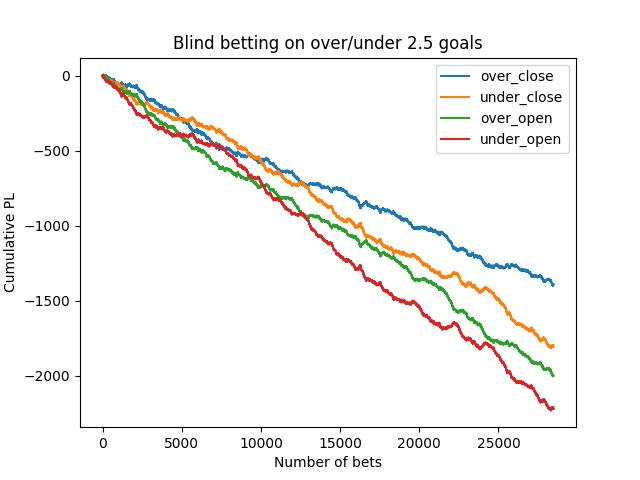
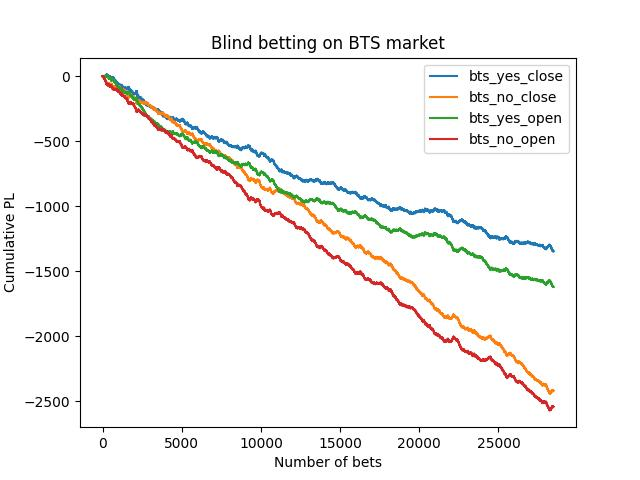

# football-data

## Description of available data

The aim of this project is to provide results & odds for various soccer league.
For now, the following data are available :
- England Premier League (from 2009/2010 to 2024/2025)
- Spain La Liga (from 2009/2010 to 2024/2025)
- Italy Serie A (from 2009/2010 to 2024/2025)
- Germany Bundesliga (from 2009/2010 to 2024/2025)
- France Ligue 1 (from 2009/2010 to 2024/2025)
- Belgium Pro League (from 2009/2010 to 2024/2025)
- Netherlands Eredivisie (from 2009/2010 to 2024/2025)
- Egypt Premier League (from 2009/2010 to 2024/2025)

The format is the following : 

with : 
- Date : date of the match
- Season
- HomeTeam
- AwayTeam
- FTHG : Full-time home goals
- FTAG : Full-time away goals
- HTHG : Half-time away goals
- HTAG : Half-time away goals
- home_close : average closing odd for home team
- home_open : average opening odd for home team
- draw_close : average closing odd for draw
- draw_open : average opening odd for draw
- away_close : average closing odd for away team
- away_open : average opening odd for away team
- over_2.5_close : average closing odd for over 2.5 goals
- over_2.5_open  : average opening odd for over 2.5 goals
- under_2.5_close : average closing odd for under 2.5 goals
- under_2.5_open  : average opening odd for under 2.5 goals
- bts_yes_close : average closing odd for both team to score
- bts_yes_open  : average opening odd for both team to score
- bts_no_close : average closing odd for both team to score
- bts_no_open  : average opening odd for both team to score

Odds have been extracted from various bookmakers among 10bet, 888sport, Bet365, Betsafe, Bwin, William Hill,Sbobet and Pinnacle.
Only average odd is provided in this first version.
BTS odds are only available since season 2012/2013.

For each league, data are proposed in csv and parquet format.
    
Don't hesitate to open an issue if you find some errors or if you have some requests. 

## Use example

